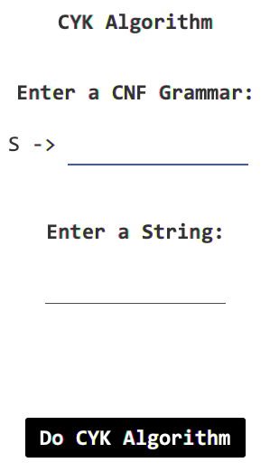

# Cocke Younger Kasami Algorithm

## Description 🔠🔡

Starting from a context-free grammar in Chomsky Normal Form G and a string w, this program establishes whether the grammar generates said string, that is, w ∈ L(G).

## Documentation 📃

Check the instruction manual of the program [here](docs/InstructionManual.pdf).

## Technical conditions 🛠️

- Programming Language 💱 : [Java](https://www.java.com/es/) [8](https://www.oracle.com/java/technologies/downloads/).
- Operating systems used 💻 : Windows 10 and MacOS Big Sur.
- Integrated Development Environment used 👨🏻‍💻 : [Eclipse IDE](https://www.eclipse.org/downloads/packages/) v. 4.23 and [Visual Studio Code](https://code.visualstudio.com/download) v. 1.67.1
- External Libraries used: [JFoeniX-8.0.10](https://github.com/jfoenixadmin/JFoenix)
- Installation 🔧 : Click on Code, then on Download ZIP.

## Authors 🖊️

[TheLordJuanes](https://github.com/TheLordJuanes)\
[CarlosJPantoja](https://github.com/CarlosJPantoja)
